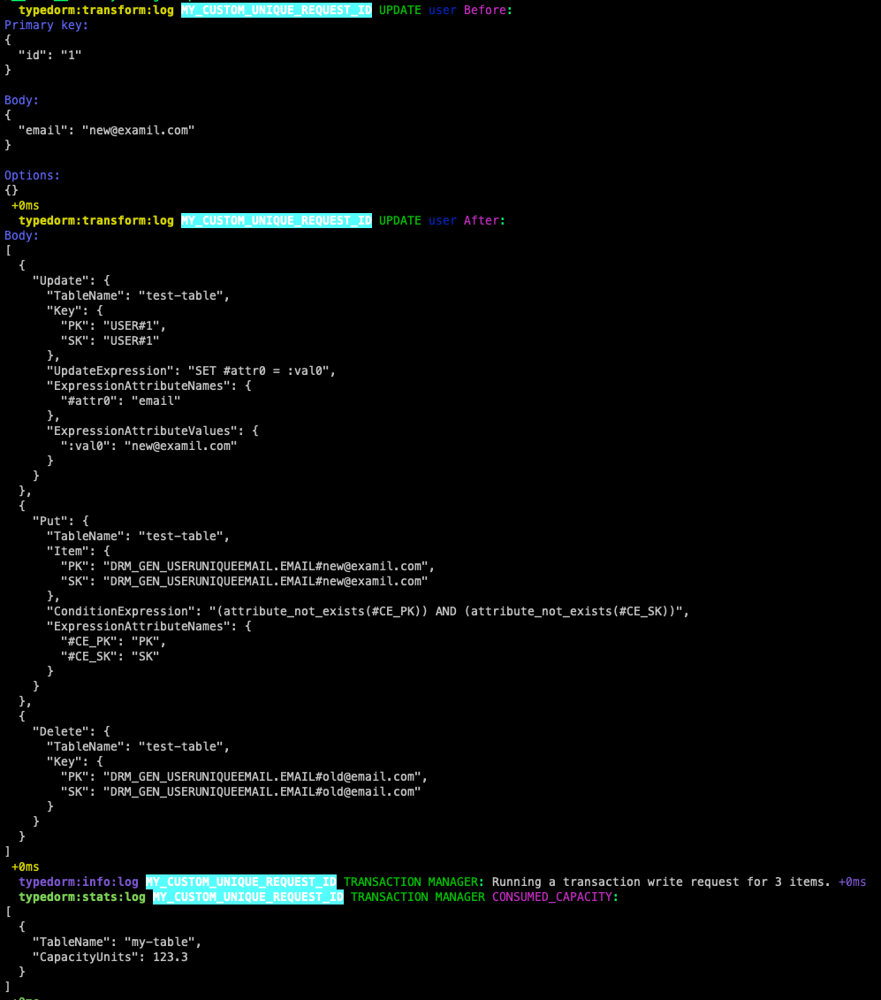

# Debugging with TypeDORM

TypeDORM implements debug based logger which can be enabled by setting `DEBUG` environment variable to `typedorm:*`.

## Debug namespaces

These are the current available debug namespaces, that TypeDORM understands.

- `typedorm:transform:log` - basic transforms, logs before and after states
- `typedorm:transform:batch:log` - logs batch transforms
- `typedorm:transform:transaction:log` - logs transaction transforms
- `typedorm:transform:*` - glob pattern that enables all kind of transform logs
- `typedorm:info:log` - logs all basic info, like hints or just static information
- `typedorm:warn:log` - logs all warnings that should be resolved
- `typedorm:error:log` - logs all errors that may have happen during the processing of a request
- `typedorm:stats:log` - logs all statistics, like consumed capacity for a request,
  - this relates directly to what the returnConsumedCapacity is set to, if `returnConsumedCapacity` is set to `NONE`, no stats log will be visible.
- `typedorm:*` - glob pattern that enables all logs

## Enabling Transform Logs

All Transform logs can be enabled by setting `DEBUG` environment variable to one of the above debug namespaces.
All the logs uses syntax highlighting (using [chalk](https://github.com/chalk/chalk))

For example, executing `EntityManager.update` operation with transformed log enabled, this will be printed to console.

```Typescript
  typedorm:transform:log d2f20c3e-2ceb-4e7b-b60c-3484016cd950 UPDATE user Before:
Primary key:
{
  "id": "1"
}

Body:
{
  "name": "user",
  "status": "active"
}

Options:
{}
 +0ms
  typedorm:transform:log d2f20c3e-2ceb-4e7b-b60c-3484016cd950 UPDATE user After:
Body:
{
  "TableName": "test-table",
  "Key": {
    "PK": "USER#1",
    "SK": "USER#1"
  },
  "UpdateExpression": "SET #attr0 = :val0, #attr1 = :val1, #attr2 = :val2, #attr3 = :val3",
  "ReturnValues": "ALL_NEW",
  "ExpressionAttributeNames": {
    "#attr0": "name",
    "#attr1": "status",
    "#attr2": "GSI1SK",
    "#attr3": "GSI1PK"
  },
  "ExpressionAttributeValues": {
    ":val0": "user",
    ":val1": "active",
    ":val2": "USER#user",
    ":val3": "USER#STATUS#active"
  }
}
 +0ms
  typedorm:transform:log d2f20c3e-2ceb-4e7b-b60c-3484016cd950 RESPONSE user Before:
Body:
{
  "PK": "USER#1",
  "SK": "USER#1",
  "GSI1PK": "USER#STATUS#active",
  "GSI1SK": "USER#Me",
  "id": "1",
  "name": "user",
  "status": "active"
}
 +0ms
  typedorm:transform:log d2f20c3e-2ceb-4e7b-b60c-3484016cd950 RESPONSE user After:
Body:
{
  "id": "1",
  "name": "user",
  "status": "active"
}
```

## Advanced debugging with unique custom requestId

From 1.13.x, With each each operation, there is now a capability to provide a unique request id ([Check Api for more details](./api.md)), which can be used to track lifecycle of entire request as it
gets processed.
PS. this logs will only appear if the `DEBUG` env is set:

i.e, here is how log trace of a update request will look like with custom `requestId` and `typedorm:*` debug namespace.


