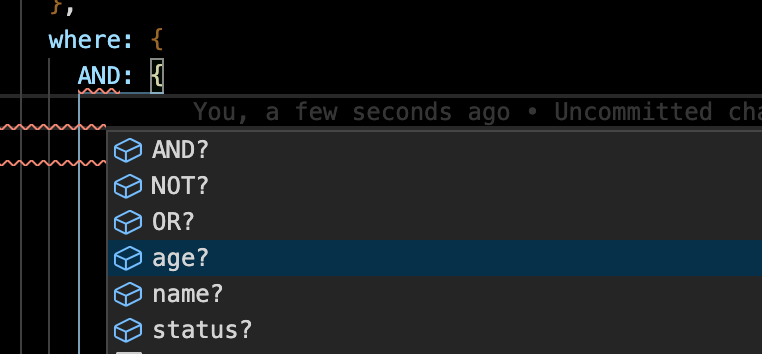
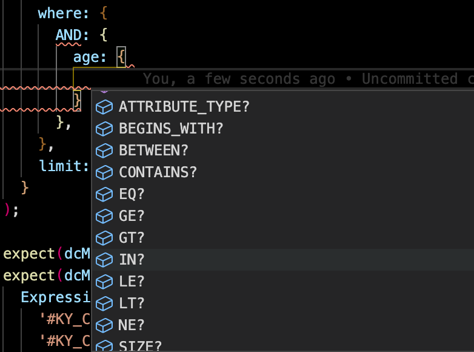

# How to recipes

This page will walk you through some of the unique recipes to enhance your development workflow when working with TypeDORM.

- [How to recipes](#how-to-recipes)
  - [Entity configuration](#entity-configuration)
    - [Define a simple entity](#define-a-simple-entity)
    - [Define an entity with attribute aliases in primary key](#define-an-entity-with-attribute-aliases-in-primary-key)
    - [Define an entity with attribute aliases in index](#define-an-entity-with-attribute-aliases-in-index)
  - [Attribute Transformation](#attribute-transformation)
    - [Using TransformToDynamo](#using-transformtodynamo)
    - [Using TransformFromDynamo](#using-transformfromdynamo)
  - [Define default values](#define-default-values)
    - [Static Default values](#static-default-values)
    - [Dynamic Default values](#dynamic-default-values)
  - [Advanced updates](#advanced-updates)
    - [Static vs Dynamic updates](#static-vs-dynamic-updates)
    - [Using SET Action](#using-set-action)
    - [Using ADD Action](#using-add-action)
    - [Using REMOVE Action](#using-remove-action)
    - [Using DELETE Action](#using-delete-action)
    - [Using multiple actions in single update](#using-multiple-actions-in-single-update)
  - [Conditional update](#conditional-update)
    - [Specify condition when using entity manager](#specify-condition-when-using-entity-manager)
  - [Conditional create](#conditional-create)
    - [Specify condition when using entity manager](#specify-condition-when-using-entity-manager-1)
  - [Conditional delete](#conditional-delete)
    - [Specify condition when using entity manager](#specify-condition-when-using-entity-manager-2)
  - [Apply filter to query](#apply-filter-to-query)
    - [Apply filter to query when using entity manager](#apply-filter-to-query-when-using-entity-manager)
  - [Write items in batches](#write-items-in-batches)
    - [Write items](#write-items)
    - [Retry unprocessed write items in batches](#retry-unprocessed-write-items-in-batches)
  - [Read items in batches](#read-items-in-batches)
    - [Read items](#read-items)
    - [Retry unprocessed read items in batches](#retry-unprocessed-read-items-in-batches)
  - [Bundling TypeDORM using webpack](#bundling-typedorm-using-webpack)

## Entity configuration

For any class to be a valid TypeDORM entity, it must be annotated with `@Entity`. While annotating with `@Entity` different
configs can be provided to customize how the entity is parsed and treated by TypeDORM.

### Define a simple entity

```Typescript
@Entity(
  name: 'user', // name of the entity that will be added to each item as an attribute
  // primary key
  primaryKey: {
    partitionKey: 'USER#{{id}}',
    sortKey: 'USER#{{id}}',
  }
)
class User {
  @Attribute()
  id: string  // <- this attribute is required as it is referenced by primary key

  // ... other optional attributes
}
```

### Define an entity with attribute aliases in primary key

```Typescript
@Entity<User>(
  name: 'user', // name of the entity that will be added to each item as an attribute
  // primary key
  primaryKey: {
    partitionKey: 'USER#{{id}}',
    sortKey: {
      alias: 'age' // <- this tells TypeDORM to auto infer "type" and "value" for partition key from age attribute.
    },
  }
)
class User {
  @Attribute()
  id: string  // <- this attribute is required as it is referenced by primary key

  @Attribute()
  age: number

}
```

### Define an entity with attribute aliases in index

```Typescript
@Entity<User>(
  name: 'user', // name of the entity that will be added to each item as an attribute
  // primary key
  primaryKey: {
    partitionKey: 'USER#{{id}}',
    sortKey: 'USER#{{id}}',
  },
  indexes: {
    GSI1: {
      type: INDEX_TYPE.GSI
      partitionKey: {
        alias: 'age' // <- this tells TypeDORM to auto infer "type" and "value" for partition key from age attribute.
      },
      sortKey: 'USER#{{age}}', // <- here, interpolated "value" will be auto inferred by TypeDORM at runtime based on the value of age
    }
  }
)
class User {
  @Attribute()
  id: string  // <- this attribute is required as it is referenced by primary key

  @Attribute()
  age: number

}
```

## Attribute Transformation

Attribute transformation in TypeDORM is enabled via third party package: class-transformer.
Most of the decorators provided by class-transformer should work by default, if there are any not behaving
the way they should be, please consider opening an issue.

All entities are passed through to class-transformer two times form any given read operation:

- First, when class instance is transformed to JSON to insert into DynamoDB.

  - `TransformToDynamo`: used to overwrite attribute at insertion time (serialization)

- Second, when receiving JSON object from DynamoDB and returning to client.

  - `TransformFromDynamo`: used to overwrite attribute at retrieval time (de-serialization)

### Using TransformToDynamo

```Typescript
@Entity({
  ...entity options
})
export class Photo {
  @Attribute()
  @Type(() => Date)
  @TransformToDynamo(({value}: {value: Moment}) => value.toString())
  createdAt: Moment;
}

```

### Using TransformFromDynamo

```Typescript
@Entity({
  ...entity options
})
export class Photo {

  @Attribute()
  @Type(() => Date)
  @TransformFromDynamo(({value}) => moment(value))
  createdAt: Moment;
}

```

## Define default values

`@Attribute` supports specifying default values by providing default values to add to entity at the creation time.

### Static Default values

```Typescript
@Entity(
  //...entity spec
)
class User {

  @Attribute()
  id: string

  @Attribute()
  firstName: string

  @Attribute()
  lastName: string

  @Attribute(
    default: 'available'
  )
  status: string
}
```

### Dynamic Default values

```Typescript
@Entity(
  //...entity spec
)
class User {

  @Attribute()
  id: string

  @Attribute()
  firstName: string

  @Attribute()
  lastName: string

  @Attribute(
    default: 'available'
  )
  status: string

  @Attribute<User>(
    default: (user) => `${user.firstName} ${user.lastName}`
  )
  name: string
}

// now when creating user record using one of the entity/transaction manager name will be auto appended,

const user = new User();
user.firstName = 'Mark'
user.lastName = 'Zuk'

// here `user.name` will be `Mark Zuk` from above defined pattern
```

| **A word of advice**: There is also a `@AutoGenerateAttribute` which comes with some most used strategies and should be used over implementing own specification.

## Advanced updates

Starting with 1.14.0, TypeDORM now has a full support for generating update expression for all actions in the most type safe way possible. It even allows combining multiple actions in a single requests.

### Static vs Dynamic updates

There are some update actions whose results can not be calculated before the update has happened (they are considered dynamic attribute updates), such as `ADD`. For these actions, it is almost impossible for TypeDORM to statically infer the end result for attributes and there for they can not be used in conjunction with other attributes that references one or many of `Indexes`, `PrimaryKey` or `UniqueAttribute`.

These are the scenario where attribute to be updated can not have dynamic values:

- Updating unique attributes
- Updating primary key attributes
- Updating attributes that references one or more indexes

You should also be aware that, custom transformation applied to attribute using `@TransformToDynamo` will not run for update actions where attribute had dynamic value attached to it.

Please have a look at the table below to determine if the update you are trying to perform is considered static or dynamic.

| Action | Operation        | description                                                             | type    |
| ------ | ---------------- | ----------------------------------------------------------------------- | ------- |
| SET    | =                |                                                                         | static  |
| SET    | \$attribute[0] = | Trying to set value of nested attribute or on a specific item in a list | dynamic |
| SET    | IF_NOT_EXISTS    |                                                                         | static  |
| SET    | LIST_APPEND      |                                                                         | dynamic |
| SET    | INCREMENT_BY     |                                                                         | dynamic |
| SET    | DECREMENT_BY     |                                                                         | dynamic |
| ADD    | \*               |                                                                         | dynamic |
| DELETE | \*               |                                                                         | dynamic |
| REMOVE | \*               |                                                                         | dynamic |

### Using SET Action

Set operations support Implicit and Explicit syntax. For example, writing `name: {SET: "new name"}` is identical to writing `name: "new name'`.

Here is an example of how one would write a `SET` update action. By default all attributes are parsed to build a SET
action.

```Typescript
const updatedResponse = await entityManager.update(
  User,
  {
    id: '1'
  },
  {
    name: 'new name' // this is be considered set update
    email: {
      SET: 'new name' // this is same as above
    }
  }
)

// this will generate following update expression with given values
// UpdateExpression: 'SET #UE_name :UE_name, #UE_email :UE_email',
```

### Using ADD Action

`ADD` action is only supported for number, sets and list types. For more up-to-date information always look at the
[official aws-sdk guide](https://docs.aws.amazon.com/amazondynamodb/latest/developerguide/Expressions.UpdateExpressions.html).

```Typescript
const updatedResponse = await entityManager.update(
  User,
  {
    id: '1'
  },
  {
    age: {
      ADD: 2
    },
    addresses: {
      ADD: ["new address"]
    },
    roles: {
      ADD: new SET(["admin"])
    }
  }
)

// this will generate following update expression with given values
// UpdateExpression: 'ADD #UE_age :UE_age, #UE_addresses :UE_addresses',
```

### Using REMOVE Action

For more up-to-date information always look at the
[official aws-sdk guide](https://docs.aws.amazon.com/amazondynamodb/latest/developerguide/Expressions.UpdateExpressions.html).

```Typescript
const updatedResponse = await entityManager.update(
  User,
  {
    id: '1'
  },
  {
    age: {
      REMOVE: true
    },
    addresses: {
      REMOVE: {
        $AT_INDEX: [2]
      }
    }
  }
)

// this will generate following update expression with given values
// UpdateExpression: 'REMOVE #UE_age, #UE_addresses[2]',
```

### Using DELETE Action

`DELETE` action is only supported with Set data types. For more up-to-date information always look at the
[official aws-sdk guide](https://docs.aws.amazon.com/amazondynamodb/latest/developerguide/Expressions.UpdateExpressions.html).

```Typescript
const updatedResponse = await entityManager.update(
  User,
  {
    id: '1'
  },
  {
    color: {
      DELETE: ["red", "blue"]
    },
    roles: {
      DELETE: new SET(["admin"])
    }
  }
)

// this will generate following update expression with given values
// UpdateExpression: 'DELETE #UE_color :UE_color',
```

### Using multiple actions in single update

```Typescript
  const update = expInputParser.parseToUpdate<User>({
    id: '2',
    name: {
      IF_NOT_EXISTS: {
        $PATH: 'id',
        $VALUE: '123',
      },
    },
    status: {
      SET: {
        IF_NOT_EXISTS: 'active',
      },
    },
    age: {
      ADD: 1,
    },
    addresses: {
      DELETE: ['123'],
    },
  });

// this will generate following update expression with given values
// UpdateExpression: 'SET #UE_id = :UE_id, #UE_name = if_not_exists(#UE_id, :UE_name), #UE_status = if_not_exists(#UE_status, :UE_status) ADD #UE_age :UE_age DELETE #UE_addresses :UE_addresses',
```

## Conditional update

### Specify condition when using entity manager

To Perform a conditional update, specify a condition in a `where` option. The given condition must evaluate to true in order for operation to succeed.

```Typescript
const updatedResponse = await entityManager.update(
  User,
  {
    id: '1'
  },
  {
    name: 'new name'
  },
  {
    where: {
      age: {
        BETWEEN: [2,5]
      }
    }
  }
)

// this will generate following condition expression with given values
// ConditionExpression: '#CE_age BETWEEN :CE_age_start AND :CE_age_end',
```

## Conditional create

### Specify condition when using entity manager

To Perform a conditional create, specify a condition in a `where` option. The given condition must evaluate to true in order for operation to succeed.

```Typescript
const newUser = new User();
newUser.age = 3;
const updatedResponse = await entityManager.create(
  newUser,
  {
    where: {
      age: {
        BETWEEN: [2,5]
      }
    }
  }
)

// this will generate following condition expression with given values
// ConditionExpression: '#CE_age BETWEEN :CE_age_start AND :CE_age_end',
```

## Conditional delete

### Specify condition when using entity manager

To Perform a conditional create, specify a condition in a `where` option. The given condition must evaluate to true in order for operation to succeed.

```Typescript
const updatedResponse = await entityManager.delete(
  User,
  {
    id: '1'
  },
  {
    where: {
      status: {
        NE: "active"
      }
    }
  }
)

// this will generate following condition expression with given values
// ConditionExpression: '#CE_status <> :CE_status',
// #CE_status is 'status',
// :CE_status is 'active'
```

## Apply filter to query

### Apply filter to query when using entity manager

TypeDORM can help you with building fluent filter expressions and all with full type safety.

i.e when writing query using entity manager for entity 'User', it can intelligently provide you with all the supported filter options so
no more typos.

 

```Typescript
const users = await entityManager.find<User, UserPrimaryKey>(
    User,
    {
      id: 'aaaa',
    },
    {
      keyCondition: {
        BEGINS_WITH: 'USER#',
      },
      where: {
        AND: {
          age: {
            BETWEEN: [1, 5],
          },
          name: {
            EQ: 'Me',
          },
          status: 'ATTRIBUTE_EXISTS',
        },
      },
      limit: 10,
    }
  );


// this will generate following filter expression
// (#FE_age BETWEEN :FE_age_start AND :FE_age_end) AND (#FE_name = :FE_name) AND (attribute_exists(#FE_status))
```

## Write items in batches

Batch manager provides an easy to use interface for writing items in a batch.
TypeDORM's batch manager can process unlimited number of items when writing items to a dynamodb even while using document client's batch api. The way it does it is by separating all request items into multiple batches of 25 items and processes them somewhat parallel with given concurrency.

Let's look at an example of writing items over batch manager api

### Write items

```Typescript
import {WriteBatch, BatchManager} from '@typedorm/core'

const user = new User();
user.id = '1';
// ...other user props

// first we create a write batch instance with all the items that we would like to write in a batch
const batchToWrite = new WriteBatch()
  .addCreateItem(user)
  .addDeleteItem<Organisation, OrgPrimaryKey>(Organisation, {id: 'org-1'})
  ....other items

const batchResponse = await getBatchManager().write(batchToWrite, {
  concurrency: 10, // max 10 requests are run in parallel
  ...other optional options
})

// response
// batchResponse.failedItems - items that failed to put
// batchResponse.unprocessedItems - items that failed to process even after all retries
```

### Retry unprocessed write items in batches

If item was not processed even after x retries, it is returned back to user as `unprocessedItems`, if this was because low write throughput and you need to retry, you can do this very easily like this:

```Typescript
import {WriteBatch, BatchManager} from '@typedorm/core'

// i.e suppose there were x items returned as unprocessed items from earlier batch write attempt

// first create a new batch from earlier unprocessed items,
const newBatchFromUnprocessedItems = new WriteBatch().add(batchResponse.unprocessedItems)

const retryBatchWriteResponse = await getBatchManager().write(newBatchFromUnprocessedItems)

// response
// run some application logic.
```

## Read items in batches

Similarly to Batch manager's `write` op, `read` op also supports getting unlimited items in batches.

Let' look at how batch manger's read op works:

### Read items

```Typescript
import {ReadBatch, BatchManager} from '@typedorm/core'

// first we create a read batch instance with all the keys that we would like to get items for
const batchItemsToRead = new ReadBatch()
  .addGetItem<User, UserPrimaryKey>({
    item: User,
    primaryKey: {
      id: '1'
    }
  })
  .addGetItem<Org, OrgPrimaryKey>({
    item: Org,
    primaryKey: {
      id: 'org-1'
    }
  })
  ....other items

const batchResponse = await getBatchManager().read(batchItemsToRead, {
  concurrency: 3, // max 3 requests are run in parallel
  ...other optional options
})

// batchResponse.items - all items returned
// batchResponse.unprocessedItems - all unprocessed items (item and primaryKey)
// batchResponse.failedItems - items that failed to get
```

_Note: When reading items in batches, order of items returned is not guaranteed._

### Retry unprocessed read items in batches

Again similar to write items, read items can also be manually retried like this:

```Typescript
import {ReadBatch, BatchManager} from '@typedorm/core'

// i.e suppose there were x items returned as unprocessed items from earlier batch read attempt

// first create a new batch from earlier unprocessed items,
const newBatchFromUnprocessedItems = new Read().add(batchResponse.unprocessedItems)

const retryBatchWriteResponse = await getBatchManager().read(newBatchFromUnprocessedItems)

// response
// run some application logic.
```

## Bundling TypeDORM using webpack

TypeDORM is often useful in serverless environments (when running it it on lambda) or executing it from browser directly, in either cases you might want to bundle the TypeDORM and other dependencies into single runable file.
From v1.15.0 TypeDORM by default ships with two different formats out of the box. Commonjs - for legacy packages and is the default in most cases, and ESM - for treeshakable bundling.

For a working example on bundling TypeDORM with webpack refer to this [link](https://github.com/typedorm/typedorm-examples).
